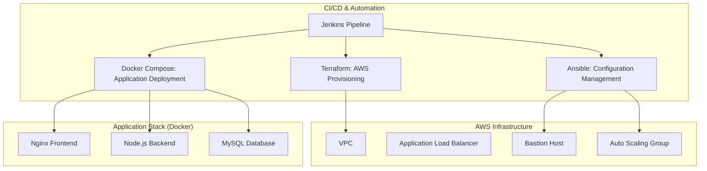

# One-Click Employee Management Infrastructure

An automated, end-to-end deployment pipeline for a 3-tier Employee Management Application. This project leverages **Infrastructure as Code (IaC)**, **Configuration Management**, and **Container Orchestration** to deliver a "one-click" deployment experience.

---

## 🏗️ Architecture Overview

The project automates the provisioning of AWS infrastructure and the deployment of a containerized 3-tier application.



---

## 🚀 One-Click Deployment

The entire stack is managed via a **Jenkins Pipeline** (`Jenkinsfile`).

### 1. Prerequisites
- Jenkins server with AWS and SSH credentials configured.
- AWS Account with appropriate IAM permissions.

### 2. Deployment Steps
1. Open your Jenkins project.
2. Select **Build with Parameters**.
3. Set `TF_ACTION` to `apply`.
4. Click **Build**.

The pipeline will automatically:
1. **Provision**: Create VPC, Subnets, EC2 instances, and ALB using Terraform.
2. **Configure**: Install Docker and Docker Compose on target servers using Ansible.
3. **Deploy**: Build and start the Employee Management App using Docker Compose.
4. **Verify**: Perform health checks on the frontend and API endpoints.

---

## 📂 Project Structure

- **`/terraform`**: Infrastructure as Code. Defines AWS resources (VPC, ALB, ASG, Bastion).
- **`/ansible`**: Configuration management. Installs Docker and manages server setup.
- **`/docker`**: The core application logic.
    - **`/backend`**: Node.js Express API.
    - **`/nginx`**: Frontend UI served via Nginx.
    - **`/database`**: MySQL initialization scripts.
- **`Jenkinsfile`**: Orchestrates the entire deployment lifecycle.

---

## 🛠️ Key Components

### 1. Terraform (AWS Infrastructure)
- Fully variabilized for reusability.
- Manage VPC, public/private subnets, and security groups.
- Load Balancer (ALB) handles traffic distribution to the application.

### 2. Ansible (Provisioning)
- Automates Docker and Docker Compose installation.
- Dynamically generates inventory based on Terraform outputs.

### 3. Employee Management App (Docker)
- **Frontend**: Modern gradient UI with full CRUD functionality.
- **Backend API**: Robust Node.js service with MySQL connection pooling.
- **Reliability**: Health checks and automated single-quote fix for name stability.

---

## 🔧 Manual Deployment (Local/Dev)

To run the application locally for development:

```bash
cd docker
docker-compose up -d --build
```
Access the application at `http://localhost:3000`.

---

## 🛡️ Security & Best Practices
- **Bastion Host**: Secure access to private instances.
- **Networking**: Application logic and database reside in private subnets.
- **Variabilization**: No hardcoded credentials or environment-specific values in code.
- **Containerization**: Isolated environments for database, API, and frontend.

---

## 📄 License
MIT
